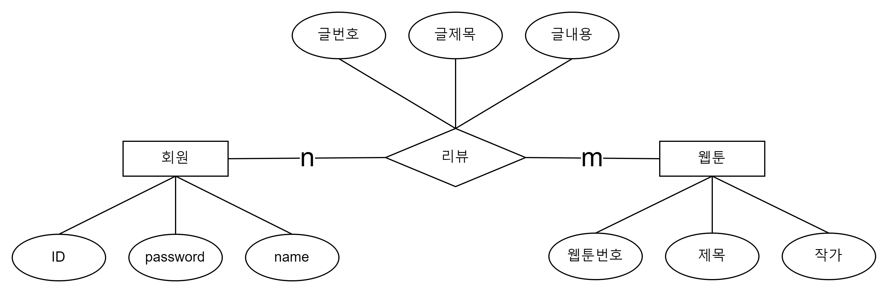
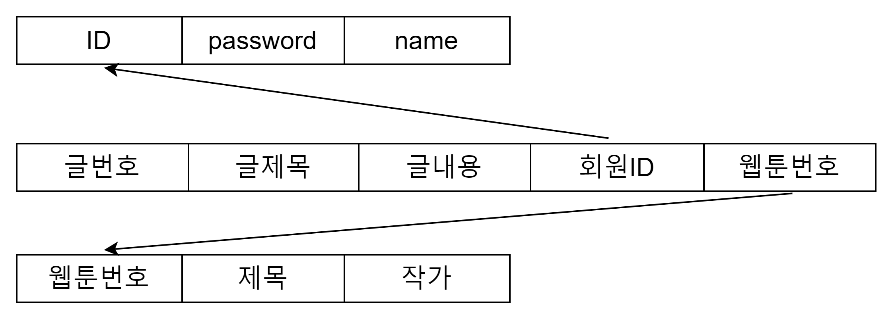

# 미션 - 웹툰 리뷰

웹툰의 후기를 조회하거나 작성한다.

---

## 기능 목록

+ [ ] 회원가입 기능
+ [ ] 로그인 기능
+ [ ] 웹툰의 후기를 조회하는 기능
+ [ ] 웹툰의 후기를 작성하는 기능

### Database
+ [ ] 회원 개체는 ID, 패스워드, 이름을 속성으로 가진다.
  + [ ] 회원 개체는 ID로 식별한다. 
+ [ ] 웹툰 개체는 웹툰번호, 제목, 작가를 속성으로 가진다.
  + [ ] 웹툰 개체는 웹툰번호로 식별한다.
+ [ ] 회원은 웹툰에 대한 여러 리뷰를 작성할 수 있고, 웹툰도 여러 리뷰를 가질 수 있다. 
  + [ ] 리뷰 개체는 글번호, 글제목, 글내용을 속성으로 가진다.
  + [ ] 리뷰 개체는 글번호로 식별한다.

